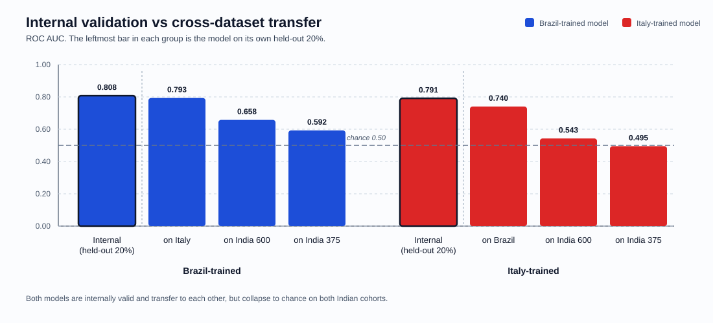

# COVIPRED-INDIAN

Cross-cohort COVID-19 prediction experiments using routine blood-test features, with notebooks for:

- internal model development on the India cohort
- internal validation and hyperparameter tuning for the Brazil and Italy cohorts
- external transfer testing with Brazil-trained and Italy-trained XGBoost models
- saved metrics, prediction files, and model artifacts for reproducible comparison

## Repository layout

- `Codes/`
  Notebook implementations for India, Brazil, and Italy workflows.
- `Data/`
  Source datasets.
- `Models/`
  Serialized model artifacts generated by the notebooks.
- `Results/`
  Metrics CSVs, training metadata, similarity outputs, and saved prediction probabilities.
- `Documentation/`
  Detailed markdown documentation for each notebook plus visual summary assets.

## Environment

Install the dependencies from `requirements.txt`:

```bash
python3 -m venv .venv
source .venv/bin/activate
pip install -r requirements.txt
```

Then launch Jupyter and run the notebook you want:

```bash
jupyter notebook
```

## What each notebook does

### `Codes/India.ipynb`

- builds an India training set from BITSM negatives and ESI positives
- trains and tunes four models: XGBoost, AdaBoost, Random Forest, and Decision Tree
- evaluates both the original 375-sample dataset and a SMOTE-balanced 600-sample dataset
- saves best-model pickles and result summaries

### `Codes/Brazil.ipynb`

- tunes an XGBoost model on a stratified 64/16/20 split of the Brazil cohort and reports internal metrics on the held-out 20%
- refits the selected hyperparameters on the full Brazil cohort to produce the final model
- harmonizes feature names to match the India/Italy schema
- evaluates transfer performance on India 375, India SMOTE 600, and Italy

### `Codes/Italy.ipynb`

- tunes an XGBoost model on a stratified 64/16/20 split of the Italy cohort and reports internal metrics on the held-out 20%
- refits the selected hyperparameters on the full Italy cohort to produce the final model
- aligns features to the shared laboratory panel
- evaluates transfer performance on India 375, India 600, and Brazil

## Headline results

### India internal training

The strongest internal result comes from XGBoost on the SMOTE-balanced India dataset, with `0.983` test accuracy and `0.999` AUC. On the original India dataset, XGBoost, AdaBoost, and Random Forest all reach `0.973` test accuracy, while XGBoost provides the best sensitivity/specificity balance.

| Dataset | Best model | Test accuracy | Sensitivity | Specificity | AUC |
|---|---|---:|---:|---:|---:|
| India original 375 | XGBoost | 0.973 | 0.933 | 0.983 | 0.996 |
| India SMOTE 600 | XGBoost | 0.983 | 0.983 | 0.983 | 0.999 |


### Brazil and Italy internal validation

Both cohort models are tuned on a stratified 64/16/20 split and scored once on the untouched 20%. These numbers are the reference point that makes the transfer results below interpretable: they show each model is genuinely discriminative in its own cohort.

| Model | Held-out test | Accuracy | Balanced accuracy | Sensitivity | Specificity | ROC AUC | Selected hyperparameters |
|---|---:|---:|---:|---:|---:|---:|---|
| Brazil | 2,384 | 0.796 | 0.683 | 0.445 | 0.921 | 0.808 | `max_depth=3, lr=0.1, n_estimators=100` |
| Italy | 278 | 0.737 | 0.728 | 0.817 | 0.640 | 0.791 | `max_depth=5, lr=0.1, n_estimators=100` |

### Cross-dataset transfer

Transfer performance is materially weaker than either the internal India results or the two cohorts' own internal validation. The best external result is the Italy-trained model evaluated on Brazil, with `0.654` accuracy and `0.678` balanced accuracy.

| Model | Evaluation set | Accuracy | Balanced accuracy | Sensitivity | Specificity | ROC AUC |
|---|---|---:|---:|---:|---:|---:|
| Brazil-trained | India 375 | 0.795 | 0.522 | 0.067 | 0.977 | 0.592 |
| Brazil-trained | India 600 | 0.543 | 0.543 | 0.103 | 0.983 | 0.658 |
| Brazil-trained | Italy | 0.644 | 0.670 | 0.416 | 0.925 | 0.793 |
| Italy-trained | India 375 | 0.528 | 0.490 | 0.427 | 0.553 | 0.495 |
| Italy-trained | India 600 | 0.502 | 0.502 | 0.490 | 0.513 | 0.543 |
| Italy-trained | Brazil | 0.654 | 0.678 | 0.731 | 0.626 | 0.740 |

Setting the internal and external results side by side isolates where generalization actually fails. Each model keeps most of its discrimination when moved to the *other* European/South American cohort — Brazil drops only `0.015` AUC on Italy, Italy drops `0.051` on Brazil — but both fall to chance on the Indian cohorts. Because the same models score `0.79`-`0.81` on their own held-out data, that collapse is a property of the India transfer rather than of an undertrained model.




## Saved outputs

Important generated files include:

- `Results/India375.csv`
- `Results/IndiaSmote600.csv`
- `Results/Brazil_metrics.csv`
- `Results/Italy_metrics.csv`
- `Results/Brazil_internal_metrics.csv`
- `Results/Italy_internal_metrics.csv`
- `Results/Brazil_tuning_results.csv`
- `Results/Italy_tuning_results.csv`
- `Results/Brazil_internal_test_preds.csv`
- `Results/Italy_internal_test_preds.csv`
- `Results/training_metadata_375_original.csv`
- `Results/training_metadata_600_smote.csv`
- `Models/best_XGBoost_original.pkl`
- `Models/best_XGBoost_smote.pkl`
- `Models/brazil_model.pkl`
- `Models/italy_model.pkl`
- `Models/brazil_model_holdout.pkl`
- `Models/italy_model_holdout.pkl`

## Detailed documentation

- [India model implementation](Documentation/India_Model_Implementation.md)
- [India training results](Documentation/India_Training_Results.md)
- [Brazil model implementation](Documentation/Brazil_Model_Implementation.md)
- [Brazil training results](Documentation/Brazil_Training_Results.md)
- [Italy model implementation](Documentation/Italy_Model_Implementation.md)
- [Italy training results](Documentation/Italy_Training_Results.md)

## Notes

- The README figures are lightweight SVG summaries derived from the saved notebook outputs and documented confusion matrices.
- The cross-dataset summary CSVs now report ROC AUC from predicted probabilities (`predict_proba`) rather than hard class predictions.
- The reported `F2 Score` values use `fbeta_score(beta=2)`.
- Brazil and Italy hyperparameters are selected on a single validation holdout, not by cross-validation. This is a deliberate design choice; with 222 validation samples the Italy selection in particular is noisy, and the grid was kept coarse to limit selection on noise.
- Hyperparameter selection uses accuracy as the objective, matching `Codes/India.ipynb`. On the imbalanced Brazil cohort this favours specificity, which is why the Brazil model's sensitivity is low at the default `0.5` threshold. The notebooks' `computemetrics()` helper reports the `0.15` threshold alongside it.
- Both `Data/3-fourteen-feature.csv` and `Data/Dataset-2a.csv` arrive already z-scored across their full cohorts, so the train/validation/test splits inherit scaling statistics computed over all rows. This cannot be removed without the raw, unstandardized values.
