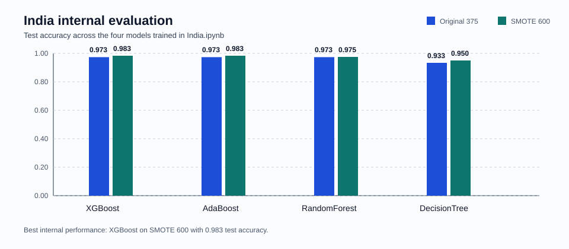
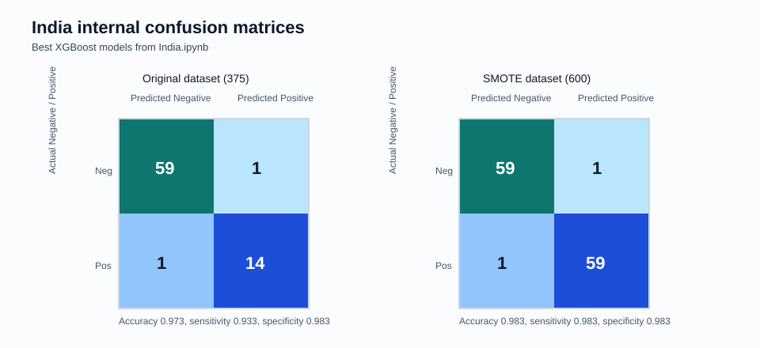
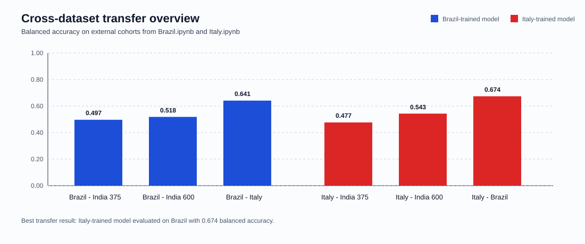
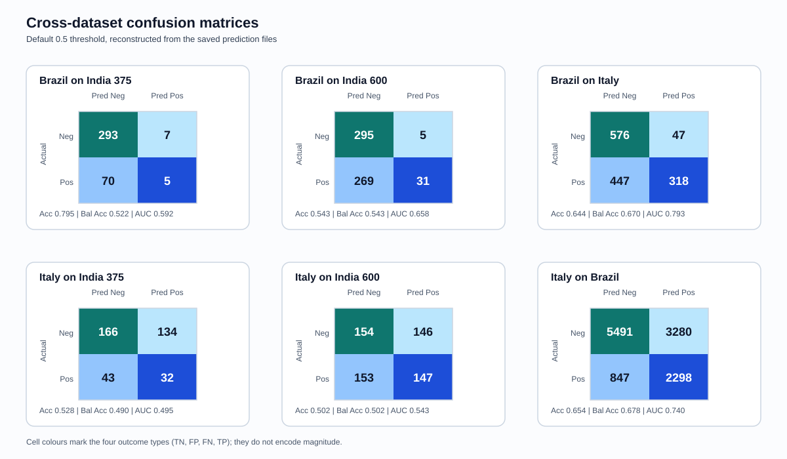

# COVIPRED-INDIAN

Cross-cohort COVID-19 prediction experiments using routine blood-test features, with notebooks for:

- internal model development on the India cohort
- external transfer testing with Brazil-trained and Italy-trained XGBoost models
- saved metrics, prediction files, and model artifacts for reproducible comparison

## Repository layout

- `Codes/`
  Notebook implementations for India, Brazil, and Italy workflows.
- `Data/`
  Source datasets and one saved Brazil-on-India-SMOTE prediction export.
- `Models/`
  Serialized model artifacts generated by the notebooks.
- `Results/`
  Metrics CSVs, training metadata, similarity outputs, and saved prediction probabilities.
- `Documentation/`
  Detailed markdown documentation for each notebook plus visual summary assets.

## Environment

Install the dependencies from `requirements.txt`:

```bash
python3 -m venv .venv
source .venv/bin/activate
pip install -r requirements.txt
```

Then launch Jupyter and run the notebook you want:

```bash
jupyter notebook
```

## What each notebook does

### `Codes/India.ipynb`

- builds an India training set from BITSM negatives and ESI positives
- trains and tunes four models: XGBoost, AdaBoost, Random Forest, and Decision Tree
- evaluates both the original 375-sample dataset and a SMOTE-balanced 600-sample dataset
- saves best-model pickles and result summaries

### `Codes/Brazil.ipynb`

- trains a Brazil-based XGBoost model on the full Brazil cohort
- harmonizes feature names to match the India/Italy schema
- evaluates transfer performance on India 375, India SMOTE 600, and Italy

### `Codes/Italy.ipynb`

- trains an Italy-based XGBoost model on the full Italy cohort
- aligns features to the shared laboratory panel
- evaluates transfer performance on India 375, India 600, and Brazil

## Headline results

### India internal training

The strongest internal result comes from XGBoost on the SMOTE-balanced India dataset, with `0.983` test accuracy and `0.999` AUC. On the original India dataset, XGBoost, AdaBoost, and Random Forest all reach `0.973` test accuracy, while XGBoost provides the best sensitivity/specificity balance.

| Dataset | Best model | Test accuracy | Sensitivity | Specificity | AUC |
|---|---|---:|---:|---:|---:|
| India original 375 | XGBoost | 0.973 | 0.933 | 0.983 | 0.996 |
| India SMOTE 600 | XGBoost | 0.983 | 0.983 | 0.983 | 0.999 |




### Cross-dataset transfer

Transfer performance is materially weaker than the internal India results, which is expected in a cross-country generalization setting. The best external result in this repository is the Italy-trained model evaluated on Brazil, with `0.649` accuracy and `0.674` balanced accuracy.

| Model | Evaluation set | Accuracy | Balanced accuracy | Sensitivity | Specificity |
|---|---|---:|---:|---:|---:|
| Brazil-trained | India 375 | 0.707 | 0.497 | 0.147 | 0.847 |
| Brazil-trained | India 600 | 0.518 | 0.518 | 0.177 | 0.860 |
| Brazil-trained | Italy | 0.619 | 0.641 | 0.421 | 0.862 |
| Italy-trained | India 375 | 0.499 | 0.477 | 0.440 | 0.513 |
| Italy-trained | India 600 | 0.543 | 0.543 | 0.517 | 0.570 |
| Italy-trained | Brazil | 0.649 | 0.674 | 0.727 | 0.621 |




## Saved outputs

Important generated files include:

- `Results/India375.csv`
- `Results/IndiaSmote600.csv`
- `Results/Brazil_metrics.csv`
- `Results/Italy_metrics.csv`
- `Results/training_metadata_375_original.csv`
- `Results/training_metadata_600_smote.csv`
- `Models/best_XGBoost_original.pkl`
- `Models/best_XGBoost_smote.pkl`
- `Models/brazil_model.pkl`
- `Models/italy_model.pkl`

## Detailed documentation

- [India model implementation](Documentation/India_Model_Implementation.md)
- [India training results](Documentation/India_Training_Results.md)
- [Brazil model implementation](Documentation/Brazil_Model_Implementation.md)
- [Brazil training results](Documentation/Brazil_Training_Results.md)
- [Italy model implementation](Documentation/Italy_Model_Implementation.md)
- [Italy training results](Documentation/Italy_Training_Results.md)

## Notes

- The README figures are lightweight SVG summaries derived from the saved notebook outputs and documented confusion matrices.
- The cross-dataset summary CSVs now report ROC AUC from predicted probabilities (`predict_proba`) rather than hard class predictions.
- The reported `F2 Score` values use `fbeta_score(beta=2)`.
